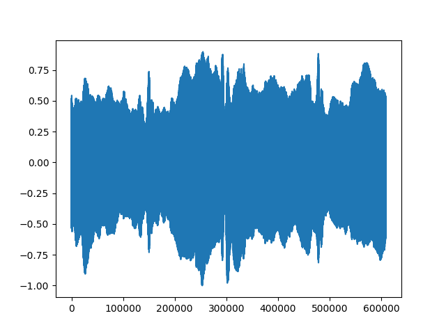
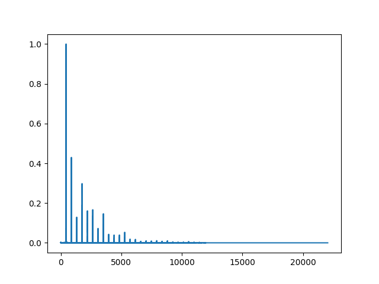
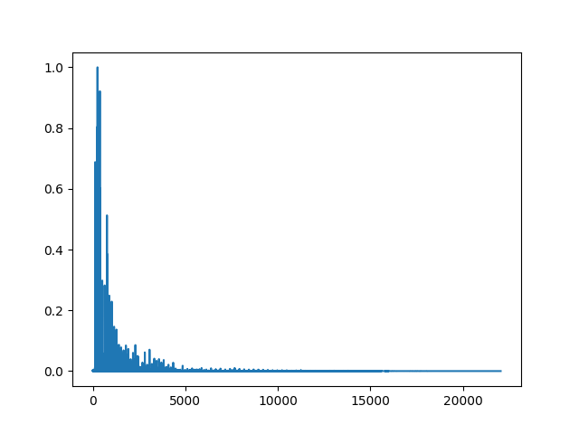
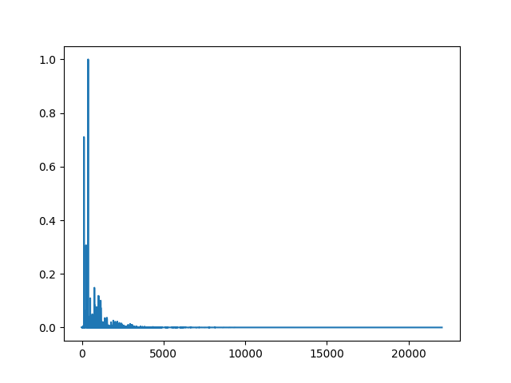
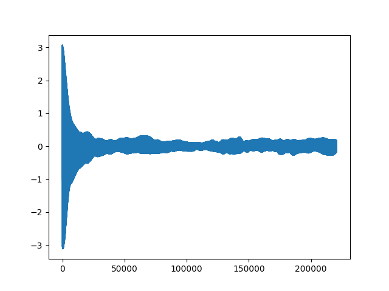
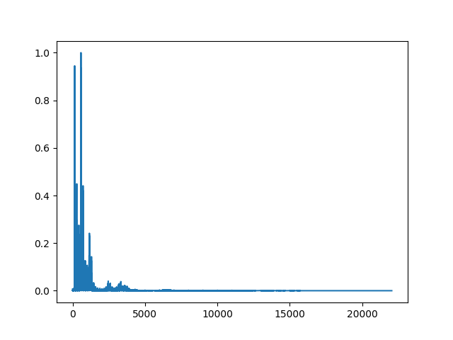

# Instrument Modeller
In this project, this Instrument Modeller extracts a musical instrument's most immense frequnecies as you want. 
- **Contents**
1. Introduction
2. Principles and Composition
3. Hardships and Feelings
4. References

## 1. Introduction
First, excute the main.py in this VOICE PROJECT folder.
```
Write file to read as instrument: 
```
Please write your desired mp3_file to convert.
```
Write file to read as instrument: x.mp3
Write fineness of sound discerning such as 0.01(hz):
```
Then, please write how fine your modelled sound would be
```
Write file to read as instrument: x.mp3
Write fineness of sound discerning such as 0.01(hz): 0.1
```
After processing, In the models folder, there will be sound modelled with less frequencies.

## 2. Principles and Composition
A sound is sum of multiple sine waves with its unique frequecy and aplitue.  
And it is expressed with function with x-axis is time, and y-axis is Amplitue.  
Given Figure is the graph of a violin playing A4(440hz). 

  
*Graph of Violin A4 Playing*


Since computer only can describe discrete data, we usually divide the given sound into x-axis(sampling) and y-axis(quantization)  
And it is known that if sampling rate is bigger or same than double of max frequency of given sound,  
it can restore its analogous sound perfectly. You can check that max x-value of upper figure is time * sampling_rate of file

We want decompose this sine wave, but it seemed to be that we can't find out any frequency-related data in this graph.  
To solve this problem.  I have used FFT(Fast Fourier Transformation) algorithm of DFT (Discrete Fourier Transform)
Which has expression like this

$$
X[k] = \sum_{n=0}^{N-1} x[n] \cdot e^{-i \frac{2\pi}{N} k n},\quad k = 0, 1, \ldots, N-1
$$

For long story short, this FFT algorithm iterates from 0 to maximum frequency, multiplies the frequency with original sound.  
Return value is graph composed of phases and frequencies as x-axis and ampliutude as y-axis shown in figure below  

  
*Freqencies and their matching amplitudes*

In this figure, Only a few amplitues are noticably high, and other frequencies are extremely row.  
Also You would notice that the intervals between local maxima are constant. That is because of **Overtones**.  
When you play a note in an instrument, Not only the note, but also notes have double,triple frequency also played.   
And this compositions make uniquenesses of various instruments. 
    
*Frequency & Amplitudes of bassoon*  
  
*Frequency & Amplitudes of cello*  

with pythonic codes, I packed them as tuples and sorted these tuples by frequecies in descending order in dictionary.  
And summed some frequencies in that dictionary, to make modelled-sound
  
*modelled sound of violin*

## 3. Hardships and Feelings

In this project, I intended to make a voice converter, which takes characteristics of a human's voice, and transforms a certain voice to given voice.  
However, A sample of human voice was more complex and un-ordered than a sample of musical instrument.  
It took a huge amount time to model, and the result was not satisfactory.

  
*the graph seems to be more continuous than instruments* 

So that i changed the direction of this project as modelling a instrument, using the same method i tried to do.

- Hardships  

It was hard for me to find how fine, accurate the gap of distiguishing to different frequency should be.   
Since there were data easy to find for this purpose. 

As you can hear, the modelled sound explodes in the beginnig, and whispers relatively silent after.  
I couldn't find solution to this, since I don't have deeper knowledge in this domain.

Aquisition of knowledge of totally different domain was also challenging.  
Luckily there was excellent videos explaing DFT,FFT and I had a background knowledge on sampling in data communication class.  
However, I cannot expect how I should figure out fit solution when I have encounted a totally unfamaliar probelm, and there is no vivid explanation for it.

- Feelings

Not only in this project, but undergoing in other tasks in computer engineering & science area, I have exprienced a lot of situations in which I have to use diver mathematical tools and concepts to solve the questions. Algorthms, Graphical expressions, Sound processings, they all required such functionalitys to me. Sometimes I solved those takes by my self, but I've received immense amount of help from anonymous peoples.
Even this Project I have used idea of those people to solve my problem. I felt myself, and quite funny to say, determined to raise such powers for my vocation, and to distribute results for people as I received.

## 4. References

- Videos  
[What makes instruments sound different?](https://www.youtube.com/watch?v=DNKaIe3VTy4) - *explanation of overtones for instruments*  
[Sum of harmonics of violin](https://www.youtube.com/watch?v=BvUMfnQucP4) - *Example of accumulating frequencies*  
[이산 푸리에 변환(DFT) 및 FFT 이해하기](https://www.youtube.com/watch?v=QmgJmh2I3Fw) - *Explanation of basic FFT/DFT idea*  
[Timbre: why different instruments playing the same tone sound different](https://www.youtube.com/watch?v=VRAXK4QKJ1Q) - *Visual explanation and sources of sounds in this project*  

- Libraries  
numpy - for manipulating sound data  
matplotlib.pyplot - for visulization of data  
sounddevice - to test and play sound in code  
pydub - loading and writing mp3 file  
os - for getting directory location  
pypinstaller - to make py to executable file

- Software  
ChatGpt - for error checking and geting snippet codes


